# Awesome Clinical Trial Management System (CTMS) 🏥⚡

  
  
  
  
  

## 📌 Overview & Market Insights 📊

> **Global CTMS Market Size & Dynamics**: The global Clinical Trial Management System (CTMS) market is estimated at **$1.8 Billion - $2.3 Billion** and is projected to reach over **$4.5 Billion by 2030** (CAGR ~12.5%). 
> 
> **Market Fragmentation**: The market is **moderately fragmented**, featuring high-valuation consolidated leaders at the enterprise sponsor level (e.g., Veeva, Medidata, Oracle) alongside specialized niche platforms catering to academic medical centers, independent research sites, and regional CROs.

---

## 📑 Table of Contents
- [🏢 SaaS & Commercial CTMS Platforms](#-saas--commercial-ctms-platforms)
- [💻 Open-Source CTMS & EDC Projects](#-open-source-ctms--edc-projects)
- [🤝 How to Contribute](#-how-to-contribute)
- [☕ Support & Sponsorship](#-support--sponsorship)
- [📈 Star History](#-star-history)
- [⚠️ Disclaimer](#%EF%B8%8F-disclaimer)

---

## 🏢 SaaS & Commercial CTMS Platforms

*Sorted by Company Size / Valuation (Descending)*

| Platform 🚀 | Company & Market Footprint 🌐 | Starting Paid Tier Pricing 💵 | Free Tier / Trial Limit 🎁 | Description & Core Strengths 💡 |
| :--- | :--- | :--- | :--- | :--- |
| **[Oracle Siebel CTMS](https://docs.oracle.com/en/industries/health-sciences/siebel-clinical/24.12/index.html)** | **$380B+ Market Cap** (Oracle Corporation) | ~$300/user/month (Enterprise licensing contract required) | No free tier; 30-day trial available via Oracle Cloud Free Tier ($300 credits) | Enterprise CTMS enabling global CROs & sponsors to manage complex trials; integrates with PowerTrials & Oracle Clinical One. |
| **[Veeva Vault CTMS](https://www.veeva.com/)** | **$32B+ Market Cap** (NYSE: VEEV) | ~$250/user/month (Annual enterprise contract minimums apply) | No free tier or trial for enterprise Vault CTMS | Premier clinical operations suite unifying study planning, site monitoring, risk-based management, and sponsor-site workflows. |
| **[Medidata CTMS](https://www.medidata.com/en/study-experience/ctms/)** | **$12.5B Enterprise Value** (Dassault Systèmes acquisition) | ~$200/user/month (Sponsor/CRO module-based pricing) | No free tier; custom sandbox demo environments provided for prospective enterprise clients | AI-enabled CTMS integrated with Medidata Rave EDC & eTMF for automated data auto-population and site oversight. |
| **[MasterControl](https://www.mastercontrol.com/)** | **$1.3B+ Valuation** (Unicorn status) | $1,200/user/year (~$100/user/month base tier) | No free tier; interactive guided product demo available on request | Quality management and compliance platform with dedicated CTMS and regulatory audit features for life sciences. |
| **[Florence Healthcare](https://florencehc.com/)** | **$500M+ Estimated Valuation** | $150/site/month base subscription | 14-day free trial for research sites | Site enablement platform automating eRegulatory binders, eISF, eConsent, and remote sponsor monitoring workflows. |
| **[Advarra OnCore](https://www.advarra.com/solutions/sites/ctms/oncore/)** | **$400M+ Revenue** (Genstar Capital portfolio) | $15,000/year site base license | No free tier; institutional demo environment upon request | Premier CTMS for Academic Medical Centers (AMCs) and NCI-designated Cancer Centers; deeply integrates with EMRs (Epic/Cerner). |
| **[Clinical Conductor](https://www.advarra.com/solutions/sites/ctms/clinical-conductor/)** | **$400M+ Revenue** (Advarra Site Division) | $350/site/month base tier | No free tier; 14-day guided sandbox demo available | Industry-standard CTMS for clinical trial sites with built-in participant billing, HIPAA text messaging (CCText), and CCPay. |
| **[Castor](https://www.castoredc.com/)** | **$100M+ Valuation** (Series B funded) | $250/study/month (Freemium for qualifying academic research) | Free plan for self-funded non-commercial academic trials (1 study, up to 50 subjects) | User-friendly clinical research platform offering EDC, eConsent, ePRO, and decentralized trial capabilities. |
| **[RealTime CTMS](https://realtime-eclinical.com/)** | **$50M+ Estimated Valuation** | $299/site/month base tier | No free tier; 14-day live sandbox environment for research sites | Cloud-based site operations management system (SOMS) bundling CTMS, eSource, eRegulatory, SitePay, and participant portals. |
| **[TrialKit](https://www.trialkit.com/)** | **$20M+ Estimated Valuation** | $199/month per active study | 30-day free trial with full feature access for up to 5 test subjects | Mobile-first eClinical platform with built-in CTMS, EDC, eConsent, and real-time trial monitoring from iOS/Android devices. |
| **[SimpleTrials](https://simpletrials.com/)** | **$10M+ Estimated Valuation** | $99/user/month (Standard plan) | 14-day full-feature free trial (no credit card required) | On-demand subscription CTMS for small-to-midsize research sites and CROs for protocol, budget, and tracking management. |
| **[SiteVault CTMS](https://sites.veevavault.help/gr/sitevault/ctms/ctms-faq/)** | **Part of Veeva Systems** | Enterprise tier custom pricing | **100% Free** for research sites managing 20 or fewer active studies | Specialized site-focused CTMS & eISF platform empowering research sites with calendar management, participant tracking, and sponsor connectivity. |

---

## 💻 Open-Source CTMS & EDC Projects

*Sorted by GitHub Stars_Count (Descending)*

| Project & Repository 📦 | GitHub Stars_Count ⭐ | Stack / Tech 🛠️ | Description & Use Case 💡 |
| :--- | :--- | :--- | :--- |
|  **[OpenClinica](https://github.com/OpenClinica/OpenClinica)** | 401+ ⭐ | Java, PostgreSQL | Foundational open-source clinical data management system (CDMS/EDC) for study building, electronic case report forms (eCRFs), and clinical audit trails. |
|  **[clinicedc](https://github.com/clinicedc/edc)** | 120+ ⭐ | Python, Django | Modular Django-based data collection and management framework for multi-center longitudinal clinical trials, developed for NIH-funded international health studies. |
|  **[LibreClinica](https://github.com/reliatec-gmbh/LibreClinica)** | 70+ ⭐ | Java, Maven | Community-driven, open-source successor to OpenClinica 3.x for electronic data capture (EDC) and data management compliant with regulatory standards. |
|  **[Phoenix CTMS](https://github.com/phoenixctms/ctsms)** | 56+ ⭐ | Java, GWT, MySQL | Complete open-source CTMS, Patient Recruitment System (PRS), and Clinical Data Management System (CDMS) for trial site operations and participant management. |
|  **[TrialPack](https://github.com/trialpack/trialpack)** | 35+ ⭐ | Python, JavaScript | Open-source clinical trial clinical data management system designed for lightweight trial management and rapid deployment. |
|  **[REDCap Community Tools](https://github.com/redcap-tools)** | 30+ ⭐ | PHP, Python | Community extensions and tooling for REDCap (Research Electronic Data Capture), widely used across academic medicine. |

---

## 🤝 How to Contribute

Contributions are highly appreciated! To contribute:
1. Fork the repository.
2. Add or update entries in `README.md` following the tabular format above.
3. Ensure pricing, valuation/size, and link details are verified.
4. Submit a Pull Request with a short summary of changes.

Check out our curated meta-list at **[Awesome-Awesome-Awesome](https://github.com/ishandutta2007/Awesome-Awesome-Awesome)** for more open-source curated collections.

---

## ☕ Support & Sponsorship

If you find this CTMS repository helpful for your clinical research, site operations, or software evaluation, please consider giving it a ⭐ star, sharing it with your network, or sponsoring the project!

---

## 📈 Star History

---

## ⚠️ Disclaimer

- This repository is a **community-curated index** for informational and educational research purposes.
- All product names, logos, and brands are property of their respective owners.
- CTMS platforms process sensitive Patient Health Information (PHI) and trial protocol data. Ensure full compliance with FDA 21 CFR Part 11, GCP, HIPAA, GDPR, and regional clinical trial regulations before deployment.
